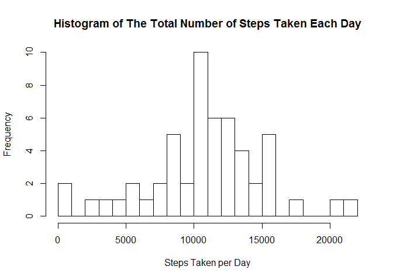
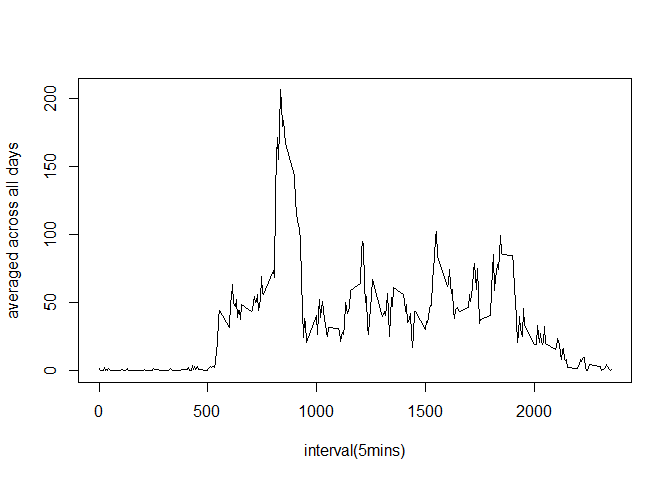
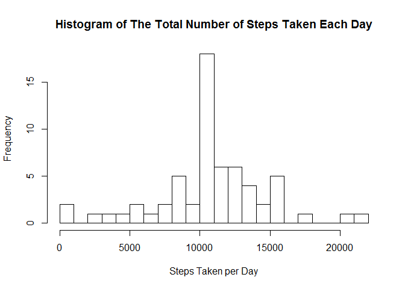

# Reproducible Research: Peer Assessment 1
Peer assessment 1 assignment for Coursera course [Reproducible Research](Reproducible Research).
PS: I modified the template since I saw a more beautiful one.

> ## Introduction
> 
> It is now possible to collect a large amount of data about personal
> movement using activity monitoring devices such as a
> [Fitbit](http://www.fitbit.com), [Nike
> Fuelband](http://www.nike.com/us/en_us/c/nikeplus-fuelband), or
> [Jawbone Up](https://jawbone.com/up). These type of devices are part of
> the "quantified self" movement -- a group of enthusiasts who take
> measurements about themselves regularly to improve their health, to
> find patterns in their behavior, or because they are tech geeks. But
> these data remain under-utilized both because the raw data are hard to
> obtain and there is a lack of statistical methods and software for
> processing and interpreting the data.
> 
> This assignment makes use of data from a personal activity monitoring
> device. This device collects data at 5 minute intervals through out the
> day. The data consists of two months of data from an anonymous
> individual collected during the months of October and November, 2012
> and include the number of steps taken in 5 minute intervals each day.
> 
> ## Data
> 
> The data for this assignment can be downloaded from the course web
> site:
> 
> * Dataset: [Activity monitoring data](https://d396qusza40orc.cloudfront.net/repdata%2Fdata%2Factivity.zip) [52K]
> 
> The variables included in this dataset are:
> 
> * **steps**: Number of steps taking in a 5-minute interval (missing
>     values are coded as `NA`)
> 
> * **date**: The date on which the measurement was taken in YYYY-MM-DD
>     format
> 
> * **interval**: Identifier for the 5-minute interval in which
>     measurement was taken
> 
> 
> 
> 
> The dataset is stored in a comma-separated-value (CSV) file and there
> are a total of 17,568 observations in this
> dataset.
> 
> 
> ## Assignment
> 
> This assignment will be described in multiple parts. You will need to
> write a report that answers the questions detailed below. Ultimately,
> you will need to complete the entire assignment in a **single R
> markdown** document that can be processed by **knitr** and be
> transformed into an HTML file.
> 
> Throughout your report make sure you always include the code that you
> used to generate the output you present. When writing code chunks in
> the R markdown document, always use `echo = TRUE` so that someone else
> will be able to read the code. **This assignment will be evaluated via
> peer assessment so it is essential that your peer evaluators be able
> to review the code for your analysis**.
> 
> For the plotting aspects of this assignment, feel free to use any
> plotting system in R (i.e., base, lattice, ggplot2)
> 
> Fork/clone the [GitHub repository created for this
> assignment](http://github.com/rdpeng/RepData_PeerAssessment1). You
> will submit this assignment by pushing your completed files into your
> forked repository on GitHub. The assignment submission will consist of
> the URL to your GitHub repository and the SHA-1 commit ID for your
> repository state.
> 
> NOTE: The GitHub repository also contains the dataset for the
> assignment so you do not have to download the data separately.
> 
> 
> 


Load necessary packages.


```r
packages <- c("data.table", "xtable", "plyr")
sapply(packages, require, character.only=TRUE, quietly=TRUE)
```

```
## data.table     xtable       plyr 
##       TRUE       TRUE       TRUE
```


> ### Loading and preprocessing the data
> Show any code that is needed to
> 
> 1. Load the data (i.e. `read.csv()`)
> 
> 2. Process/transform the data (if necessary) into a format suitable for your analysis
>
> 3. Before step 1, make sure the work directory has already been set as where the zip file is.
>

Unzip file


```r
unzip('activity.zip', overwrite=TRUE)
```

Loading data and store it into data table


```r
activity <- data.table(read.csv("activity.csv"))
```

Verify that the number of records in dataset is the expected value of 17,568.


```r
if (FALSE == (nrow(activity) == 17568)) 
        stop("The number of rows in the dataset is not 17,568.")
```

Convert the `date` variable to a date class.
And look at the structure of the dataset.


```r
activity <- activity[, date := as.Date(date)]
setkey(activity, date, interval)
str(activity)
```

```
## Classes 'data.table' and 'data.frame':	17568 obs. of  3 variables:
##  $ steps   : int  NA NA NA NA NA NA NA NA NA NA ...
##  $ date    : Date, format: "2012-10-01" "2012-10-01" ...
##  $ interval: int  0 5 10 15 20 25 30 35 40 45 ...
##  - attr(*, ".internal.selfref")=<externalptr> 
##  - attr(*, "sorted")= chr  "date" "interval"
```

```r
activity
```

```
##        steps       date interval
##     1:    NA 2012-10-01        0
##     2:    NA 2012-10-01        5
##     3:    NA 2012-10-01       10
##     4:    NA 2012-10-01       15
##     5:    NA 2012-10-01       20
##    ---                          
## 17564:    NA 2012-11-30     2335
## 17565:    NA 2012-11-30     2340
## 17566:    NA 2012-11-30     2345
## 17567:    NA 2012-11-30     2350
## 17568:    NA 2012-11-30     2355
```


> ### What is mean total number of steps taken per day?
> 
> For this part of the assignment, you can ignore the missing values in
> the dataset.
> 
> 1. Make a histogram of the total number of steps taken each day
> 
> 2. Calculate and report the **mean** and **median** total number of steps taken per day

Aggregate the number of steps taken each day.
Days with missing values (`NA`) will have `NA` when aggregated.


```r
stepDaily <- activity[, list(sumSteps = sum(steps)), date]
head(stepDaily)
```

```
##          date sumSteps
## 1: 2012-10-01       NA
## 2: 2012-10-02      126
## 3: 2012-10-03    11352
## 4: 2012-10-04    12116
## 5: 2012-10-05    13294
## 6: 2012-10-06    15420
```

Plot a histogram of the total number of steps taken each day.


```r
hist(stepDaily$sumSteps, main = 
             "Histogram of The Total Number of Steps Taken Each Day", 
     xlab = "Steps Taken per Day", breaks = nrow(stepDaily)/2)
```

 

Calculate the mean and median total number of steps taken per day **before imputing**.


```r
tab <- stepDaily[, list(n = .N, nValid = sum(!is.na(sumSteps)), mean = mean(sumSteps, na.rm=TRUE), median = median(sumSteps, na.rm=TRUE))]
print(xtable(tab), type="html", include.rownames=FALSE)
```

<!-- html table generated in R 3.2.0 by xtable 1.7-4 package -->
<!-- Mon May 18 06:00:47 2015 -->
<table border=1>
<tr> <th> n </th> <th> nValid </th> <th> mean </th> <th> median </th>  </tr>
  <tr> <td align="right">  61 </td> <td align="right">  53 </td> <td align="right"> 10766.19 </td> <td align="right"> 10765 </td> </tr>
   </table>

Copy the data table `stepDaily` before imputation to be used later.


```r
stepDaily <- stepDaily[, status := "Before imputation"]
stepDailyBeforeImputation <- stepDaily
```


> ### What is the average daily activity pattern?
> 
> 1. Make a time series plot (i.e. `type = "l"`) of the 5-minute interval (x-axis) and the average number of steps taken, averaged across all days (y-axis)
> 
> 2. Which 5-minute interval, on average across all the days in the dataset, contains the maximum number of steps?

Aggregate the average number of steps taken by 5-minute interval.


```r
stepIntervals <- activity[, list(meanSteps = mean(steps, na.rm=TRUE)), interval]
```

Plot a time series of the 5-minute interval and the average number of steps taken across all days.


```r
plot(stepIntervals$interval, stepIntervals$meanSteps, xlab = "interval(5mins)",
     ylab = "averaged across all days", type = "l")
```

 


> ### Imputing missing values
> 
> Note that there are a number of days/intervals where there are missing
> values (coded as `NA`). The presence of missing days may introduce
> bias into some calculations or summaries of the data.
> 
> 1. Calculate and report the total number of missing values in the dataset (i.e. the total number of rows with `NA`s)
> 
> 2. Devise a strategy for filling in all of the missing values in the dataset. The strategy does not need to be sophisticated. For example, you could use the mean/median for that day, or the mean for that 5-minute interval, etc.
> 
> 3. Create a new dataset that is equal to the original dataset but with the missing data filled in.
> 
> 4. Make a histogram of the total number of steps taken each day and Calculate and report the **mean** and **median** total number of steps taken per day. Do these values differ from the estimates from the first part of the assignment? What is the impact of imputing missing data on the estimates of the total daily number of steps?

Calculate and report the total number of missing values in the dataset (i.e. the total number of rows with `NA`s)


```r
missingNA <- sum(is.na(activity))
print(paste("The total number of rows with 'NA's is", missingNA, "."))
```

[1] "The total number of rows with 'NA's is 2304 ."

Seperate the records with and without missing values in the dataset into two vector and fill in 'missNA' one with the mean for that 5-minute interval


```r
missNA <- activity[is.na(get("steps")),]
withoutNA <- activity[!is.na(get("steps")),]
## Set key for merge
setkey(missNA, interval)
setkey(stepIntervals, interval)

fillMean <- merge(missNA, stepIntervals, all = FALSE)
fillMean[, steps := meanSteps]
```

```
##       interval    steps       date meanSteps
##    1:        0 1.716981 2012-10-01  1.716981
##    2:        0 1.716981 2012-10-08  1.716981
##    3:        0 1.716981 2012-11-01  1.716981
##    4:        0 1.716981 2012-11-04  1.716981
##    5:        0 1.716981 2012-11-09  1.716981
##   ---                                       
## 2300:     2355 1.075472 2012-11-04  1.075472
## 2301:     2355 1.075472 2012-11-09  1.075472
## 2302:     2355 1.075472 2012-11-10  1.075472
## 2303:     2355 1.075472 2012-11-14  1.075472
## 2304:     2355 1.075472 2012-11-30  1.075472
```

```r
## Remove extra column meanSteps
fillMean <- subset(fillMean, select = -meanSteps)
```

Create a new dataset that is equal to the original dataset but with the missing data filled in.


```r
fill_activity <- rbind(withoutNA, fillMean)
setorder(fill_activity, date, interval)
head(fill_activity)
```

```
##        steps       date interval
## 1: 1.7169811 2012-10-01        0
## 2: 0.3396226 2012-10-01        5
## 3: 0.1320755 2012-10-01       10
## 4: 0.1509434 2012-10-01       15
## 5: 0.0754717 2012-10-01       20
## 6: 2.0943396 2012-10-01       25
```

Verify that there are no missing values for `steps` after imputation.


```r
tab <- fill_activity[, .N, list(isStepsMissing = is.na(steps))]
print(xtable(tab), type="html", include.rownames=FALSE)
```

<!-- html table generated in R 3.2.0 by xtable 1.7-4 package -->
<!-- Mon May 18 06:00:47 2015 -->
<table border=1>
<tr> <th> isStepsMissing </th> <th> N </th>  </tr>
  <tr> <td> FALSE </td> <td align="right"> 17568 </td> </tr>
   </table>

Verify that missingness is complete for an entire day.
Show all days with at least 1 missing value for the `steps` variable.
Calculate the proportion of records with missing values for each such day.
All proportions are 100%.


```r
Missingness <- fill_activity[, list(countMissing = sum(is.na(steps)), 
                                    countRecords = .N, 
                                    propMissing = sum(is.na(steps) / .N)), 
                             date]
Missingness[countMissing > 0]
```

```
## Empty data.table (0 rows) of 4 cols: date,countMissing,countRecords,propMissing
```

#### After imputation of missing values

Aggregate the number of steps taken each day.


```r
dtDaily <- fill_activity[, list(sumSteps = sum(steps)), date]
head(dtDaily)
```

```
##          date sumSteps
## 1: 2012-10-01 10766.19
## 2: 2012-10-02   126.00
## 3: 2012-10-03 11352.00
## 4: 2012-10-04 12116.00
## 5: 2012-10-05 13294.00
## 6: 2012-10-06 15420.00
```

Make a histogram of the total number of steps taken each day


```r
hist(dtDaily$sumSteps, main = 
             "Histogram of The Total Number of Steps Taken Each Day", 
     xlab = "Steps Taken per Day", breaks = nrow(dtDaily)/2)
```

 

Calculate the mean and median total number of steps taken per day **after imputing**.


```r
tab <- dtDaily[, list(n = .N, nValid = sum(!is.na(sumSteps)), mean = mean(sumSteps, na.rm=TRUE), median = median(sumSteps, na.rm=TRUE))]
print(xtable(tab), type="html", include.rownames=FALSE)
```

<!-- html table generated in R 3.2.0 by xtable 1.7-4 package -->
<!-- Mon May 18 06:00:47 2015 -->
<table border=1>
<tr> <th> n </th> <th> nValid </th> <th> mean </th> <th> median </th>  </tr>
  <tr> <td align="right">  61 </td> <td align="right">  61 </td> <td align="right"> 10766.19 </td> <td align="right"> 10766.19 </td> </tr>
   </table>


> ### Are there differences in activity patterns between weekdays and weekends?
> 
> For this part the `weekdays()` function may be of some help here. Use
> the dataset with the filled-in missing values for this part.
> 
> 1. Create a new factor variable in the dataset with two levels -- "weekday" and "weekend" indicating whether a given date is a weekday or weekend day.
> 
> 1. Make a panel plot containing a time series plot (i.e. `type = "l"`) of the 5-minute interval (x-axis) and the average number of steps taken, averaged across all weekday days or weekend days (y-axis). The plot should look something like the following, which was creating using **simulated data**:
> 
>  
> 
> **Your plot will look different from the one above** because you will
> be using the activity monitor data. Note that the above plot was made
> using the lattice system but you can make the same version of the plot
> using any plotting system you choose.

Create a new factor variable in the dataset with two levels -- "weekday" and "weekend" indicating whether a given date is a weekday or weekend day.
Use this solution to [collapse the factor values](https://github.com/irongoldfish/reproducible/blob/master/PA1_template.Rmd) for day of week.


```r
## Set timezone
## Sys.setlocale("LC_TIME", "en_US.UTF-8")

##paindays= c("Monday","Tuesday","Wednesday","Thursday","Friday")
paindays= c("星期一","星期二","星期三","星期四","星期五")

fill_activity$weekday <- as.factor(ifelse(weekdays(fill_activity$date)%in%paindays,"weekday","weekend"))

stepsperinterval.weekdaysplit<-ddply(fill_activity, c("interval","weekday"),summarise,
                    meansteps = mean(steps,na.rm=TRUE)
)
dtweekday <- stepsperinterval.weekdaysplit[stepsperinterval.weekdaysplit$weekday == "weekday",]
dtweekend <- stepsperinterval.weekdaysplit[stepsperinterval.weekdaysplit$weekday == "weekend",]

par(mfrow = c(2, 1))
plot(dtweekend$interval, dtweekend$meanSteps, xlab = "interval(5mins)",
     ylab = "averaged across all days", type = "l")
plot(dtweekday$interval, dtweekday$meanSteps, xlab = "interval(5mins)",
     ylab = "averaged across all days", type = "l")
```

 
